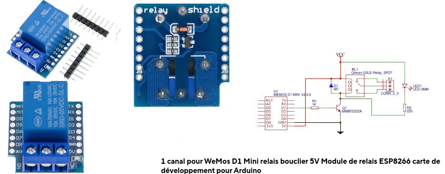
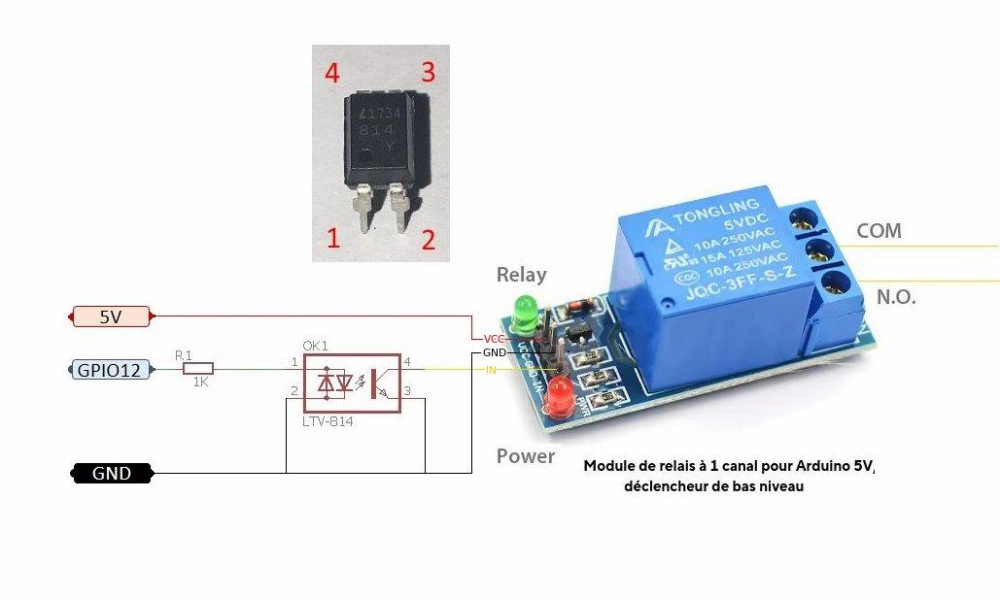
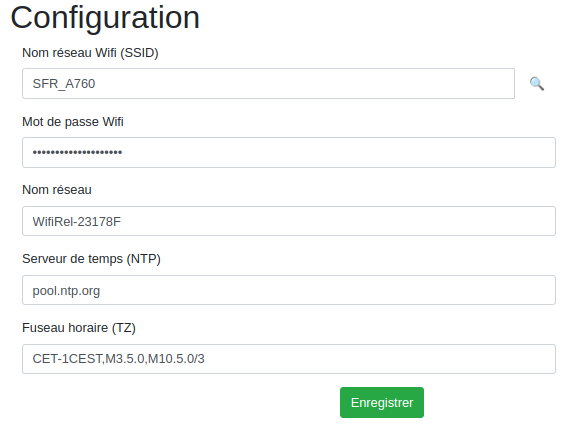
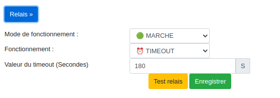
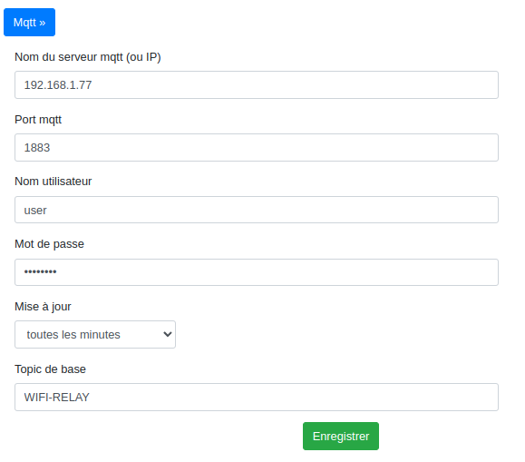
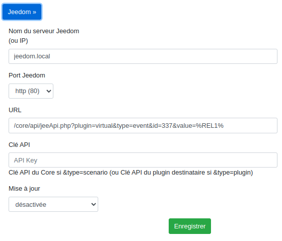
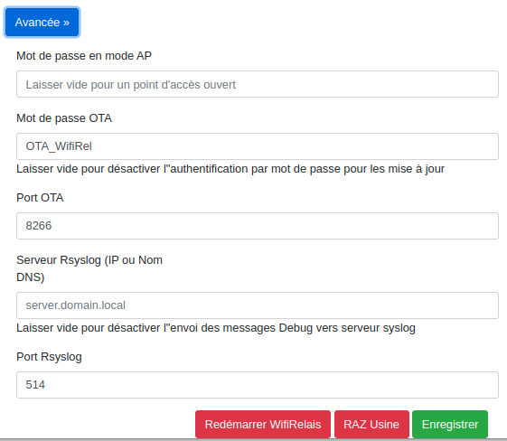
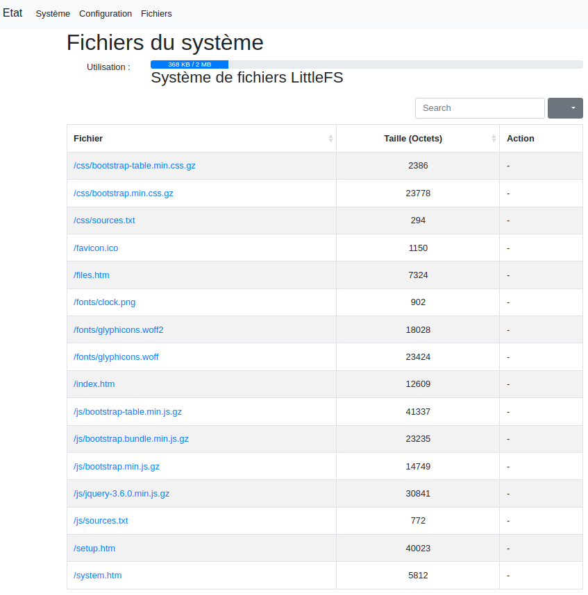
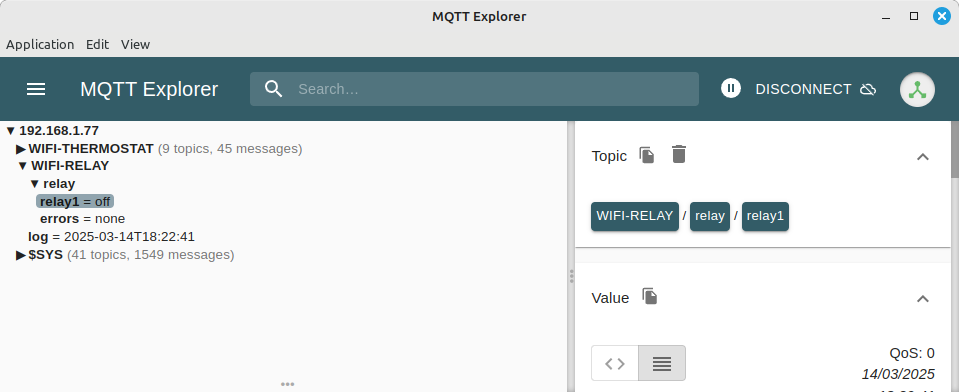

# WifiRelay : Remote relay for WifiThermostat
WifiRelay for ESP8266 or ESP32

Version en cours de construction : Non fonctionnel !!!!!!!!

## Fonctionnalités
- Serveur Web pour la configuration et le suivi (multilangue français anglais)
  - Changement de langue automatique en fonction de la langue de votre navigateur
- Accès avec le nom réseau e.g. http://<nom réseau>.local/
  - ex : wifirel-23178f.local (à entrer dans la bare d'adresse de votre navigateur) 
- Données stockées dans le système de fichier LittleFS 
- Configuration du réseau Wifi en se connectant à WifiRelay avec un téléphone mobile
- Paramétrage de la Time zone pour avoir la bonne heure : exemples
  - Paris DST : "CET-1CEST,M3.5.0,M10.5.0/3"
  - British DST : "GMT0BST,M3.5.0/01,M10.5.0/02"
  - Eastern Standard Time : "EST5EDT,M3.2.0/2,M11.1.0"
  - Indian Standard Time : "UTC-05:30"
  - China Standard Time : "CST-8CDT-8,M4.2.0/2,M9.2.0/3"
- Gestion automatique de l'heure été/hiver via la Time Zone configurée
- Paramètrage du serveur de temps (ntp)
- Réception de requète http pour positionner le relay (remplacer wifirel-23178f par le nom réseau de votre WifiRelay )
  - ex : http://wifirel-23178f.local/setrelay?relay1=on
  - ex : http://wifirel-23178f.local/setrelay?relay1=off
  - ex : http://wifirel-23178f.local/setrelay?relay1=1
  - ex : http://wifirel-23178f.local/setrelay?relay1=0 
- Envoi possible des données vers jeedom 
- Envoi possible des données à un serveur MQTT
- Envoi possible d'un requète http
  - Données envoyées :
    - %REL1% : Etat du relais ( 0 = Off ; 1 = On)
- Mise à jour via OTA (Wifi)
  - La mise à jour de logiciel peut être effectué via wifi (sans connecter la prise usb du module esp)
  - La procédure est décrite dans mon autre projet github : LibTeleinfo

## Configuration Wifi
Depuis votre téléphone portable :
- Se connecter au réseau Wifi WifiRel-XXXXXX (XXXXXX aura la valeur de votre WifiRelay)
- Navigateur (chrome ou autre) url : http://192.168.4.1
- Sélectionner l'onglet Configuration
- Réseau Wifi : Mettre le SSID (cliquer sur la loupe pour afficher la liste des réseaux et sélectionner le votre)
- Clé Wifi    : Mettre le mot de passe de votre réseau Wifi
- Clicker sur Enregistrer
- Déployer Avancée
- Cliquer sur Redémarrer Wifirelay
- Wifirelay se connectera à votre réseau Wifi
- Accéder à votre box pour connaître sa nouvelle adresse IP ou utiliser WifiRelr-XXXXXX.local (remplacer XXXXXX par votre valeur)

# Hardware

## Connection

|    Module         | Module Pin |  ESP82666   ESP12E/ESP12F | ESP8266   WEMOS D1 Mini| ESP32   ESP32 30 pin |  ESP32 Mini   ESP32-C6 14 pin |
|-------------------|------------|--------------|--------------|---------------|---------------|
| HI-LINK           | -Vo        | G            | G            | GND           |  GND          |
| HI-LINK           | +Vo        | VIN          | 5V           | VIN           |  +5V          |
|       -           |            |              |              |               |               |
|                   |            |              |              |               |               |
| RELAY (NO)        | IN1        | GPIO 12 (D6) | GPIO 12 (D6) | A4 (GPIO 32)  | GPIO 6        |
| RUF RELAY N°2     | IN1        | GPIO 14 (D5) | GPIO 14 (D5) |               | GPIO 14 select  built-in antenna |
|                   |            |              |              |               |               |
| LED INTERNE       |            | GPIO 2 (D4)   blue| GPIO 2 (D4)   blue| GPIO 2 (D2)  blue | GPIO 8 (D8)   rgb led |

- HI-LINK : HLK-PM01 : INPUT 100-240VAC 50-60Hz : OUTPUT 5VDC 3W
- RELAY              : 5V Relay Module (DC- -> -Vo ; DC+ -> +Vo)
  - Attention ESP ne supporte pas 5V : Relais 5V commandés pas un niveau bas à interfacer avec un opto-coupleur (schéma ci-dessous)

- Possible ajout petit afficheur OLED en SPI (SDA,SCL)
  - A ce jour, le code pour l'afficheur n'existe pas

Sous réserve de tests

## Relay Interface
### Version 1

- C'est une version conçue spécialement pour ESP8266 Wemos D1 mini
- Au vue des photos, il semblerait que le relais soit piloté par D1
- Le relais est actif quand l'entrée de commande passe au niveau 1
- Elle se branche directment (ESP32 aussi).
- Il existe une version plus configurable appelée 'Bouclier relais V2.0.0 pour LOLIN (WEMOS) D1 mini'
  - 7 IO configurables D0, D1, D2, D5, D6, D7, D8 (Par défaut : D1)
  - Mais c'est uniquement si on veut le plugger directement sur un Wemos D1 mini sinon on connecte D1 du relais sur le GPIO de son choix

### Version 2

- L'esp8266 ou ESP32 fonctionne en 3.3V alors que le relais est en 5V.
- Ajout d'un opto-coupleur LTV 814 et d'une résistance de 1K pour l'interface
- Quand la sortie GPIO passe au niveau 1 (3.3V) le relais passe à l'état actif
- A la mise sous tension ou en l'absence de programme, le relais est à l'état inactif
- Exemple de connexion à GPIO 12 pour un ESP8266 12F

## ESP8266 12E/12F

[esp8266 12e 12f](docs/esp12e-gpio.png)

[esp8266 HTU21 connections](docs/ESP12e-gpio-htu21.jpg)

[esp8266 DS18B20 connections](docs/ESP12e-gpio-ds18b20.jpg)

## ESP8266 WEMOS D1 Mini

[Wemos D1 Mini](docs/WEMOS-D1-Mini.jpg)

[Wemos D1 Mini BME280 connections](docs/WEMOS-D1-Mini-gpio-bme280.jpg)

## ESP32 30 Pins

[esp32 gpio](docs/ESP32-dev-kit-30pins-pinout.png)

## ESP32-C6 

[esp32-C6](docs/ESP32-C6-Mini.png)

[esp32-C6 HTU connections](docs/ESP32-C6-gpio-htu21.jpg)

# Software
|       Nom     |      Localisation         | Version |  Nom ou Lien                                                                                    |   Commentaire    | Voir | 
|---------------|---------------------------|---------|-------------------------------------------------------------------------------------------------|------------------|------|
| Arduino IDE   | Desktop                   | V1.8.18 |                                                                                                 | Pas version 2.x  | (1)  |
| Ardiuno IDE   | Fichiers/Préférences      |         | http://arduino.esp8266.com/stable/package_esp8266com_index.json                                 | Pour ESP8266     | (2)  |
| Ardiuno IDE   | Fichiers/Préférences      |         | https://espressif.github.io/arduino-esp32/package_esp32_index.json                              | Pour ESP32       | (2)  |
| Arduino IDE   | Dossier Arduino/tools     | V0.5.0  | https://github.com/esp8266/arduino-esp8266fs-plugin/releases/download/0.5.0/ESP8266FS-0.5.0.zip | Pour ESP8266     | (3)  |
| Arduino IDE   | Dossier Arduino/tools     | V2.0.7  | https://github.com/lorol/arduino-esp32fs-plugin/releases/download/2.0.7/esp32fs.zip             | Pour ESP32       | (4)  |
| Arduino IDE   | Dossier Arduino/libraries |         | https://github.com/Pedroalbuquerque/ESP32WebServer                                              | Pour ESP32       | (5)  |
| Arduino IDE   | Dossier Arduino/libraries |         | WifiRelay/librairie/Syslog-master.zip                                                           |                  | (5)  |
| Arduino IDE   | Dossier Arduino/libraries | V3.0.2  | PubSubClient V3.0.2 : https://github.com/hmueller01/pubsubclient3/releases/tag/v3.0.2           |                  | (5)  |

- (1) ESP8266 et ESP32 Skech Data Upload ne fonctionnent pas sur version 2.x
- (2) Ajouter les deux même si vous ne l'utilisez pas
- (2) Séparer les liens pas une virgule
- (2) Ne pas oublier d'aller dans le gestionnaire de cartes et d'installer : esp8266 by ESP8266 community v3.1.2
- (2) Ne pas oublier d'aller dans le gestionnaire de cartes et d'installer : esp32 by Espressif Systems v3.1.1
- (2) Après avoir relancé Arduino IDE vous devriez avoir dans le menu Outils/Type de carte 'ESP8266 Boards (3.1.2)' et 'ESP32 Arduino'
- (3) A décompresser dans le répertoire du disque Arduino/tools qui est situé à côté du répertoire Arduino/libraries (Créer le répertoire tools s'il n'existe pas)
- (3) Après avoir relancé Arduino IDE vous devriez avoir dans le menu Outils 'ESP8266 Sketch Data Upload'
- (4) A décompresser dans le répertoire du disque Arduino/tools qui est situé à côté du répertoire Arduino/libraries (Créer le répertoire tools s'il n'existe pas)
- (4) Après avoir relancé Arduino IDE vous devriez avoir dans le menu Outils vous devez avoir 'ESP32 Sketch Data Upload'
- (5) A décompresser dans le répertoire du disque Arduino/libraries
- (6) A installer que si l'on utilise ce capteur (option de compilation dans WifiTherm.h)
- (6) A installer depuis l'Arduino IDE Outils/Gérer les bibliothèques

# Web interface

## Etat de WifiRelay

## Données du système

## Configuration

### Wifi

### Relay

### Mqtt

### Jeedom

### Avancée

## Fichiers du système

# Tests
## Tests Mqtt
#### Mqtt published values

| Topic                              | Donnée             | Commentaire             |
|------------------------------------|--------------------|-------------------------|
| WIFI-RELAY/relay/relay1            | Etat du relais     | on/off                  |
| WIFI-RELAY/relay/errors            | Erreurs            | none/readSensor/sendMqtt   sendJeedom/sendHttp |

#### Mqtt update command
| Topic                              | Donnée             | Commentaire             | Voir |
|------------------------------------|--------------------|-------------------------|------|
| WIFI-RELAY/set/setmode             | Mode               | stopped/started         | (1)  |
| WIFI-RELAY/set/setconfig           | Config             | permanent/timeout       | (2)  |
| WIFI-RELAY/set/setrelay1           | Status             | off/on                  | (3)  |

- (1) Relay is off ; do not execute set/setrelay on
- (2) relay is set off if timemout occur
- (2) timeout is reseted when a new command setrelay1 on is received
- (3) values can be also 0 or 1
  
## Test Jeedom (Core V4.4.19)
### Configuration de votre jeedom

#### Création de l'objet Maison

- Outils/Objets : Cliquer sur + pour ajouter l'objet Maison
- Accès depuis la synthèse : Dashboard
- Options : Visible
- Type : Pièce

C'est nécessaire pour que le code du scénario fonctionne sans modification

#### Creation plugin virtuel Relay

- Ajouter le plugin Virtuel (gratuit)
- Dans le plugin virtuel, cliquer sur + pour ajouter 'WifiRelay'
- Configurer WifiRelay comme ci-dessous

Objet parent : Maison : Nécessaire pour que le script du scénario fonctionne sans modification

Mettez exactement les mêmes noms aux commandes, elle sont utilisées dans le script du scénario WifiThermostat

### Configuration de WifiRelay 
- Dans la section Configuration/Jeedom
- Nom du serveur jeedom : Entrer l'IP de votre jeedom
- URL : La valeur par défaut est correcte
  - Remplacer id=1 en mettant l'ID de votre commande Etat : ex : id=3 si id : 3 dans le nom de l'onglet Commande de WifiRelay
- Clé API : Entrer la clef API du core de votre jeedom
- Mise à jour : Toutes les minutes
- Cliquer sur Enregistrer
- Dans Avancer, cliquer sur 'Redémarrer WifiRelay'

### Jeedom Dashboard Maison

# Outils à installer (optionnel)
Pour le debug des exceptions qui apparaitrait dans 'Outils/Moniteur série'

Cela permet de convertir les valeurs hexadécimales en nom et numéro de ligne du code source

## Installation
|       Nom     |      Localisation         | Version  |  Nom ou Lien                                                                                           |   Commentaire   | Voir | 
|---------------|---------------------------|----------|--------------------------------------------------------------------------------------------------------|-----------------|------|
| Arduino IDE   | Desktop                   | V1.8.18  |                                                                                                        | Pas version 2.x | (1)  |
| Arduino IDE   | Dossier Arduino/tools     | V2.0.0   | https://github.com/me-no-dev/EspExceptionDecoder/releases/download/2.0.0/EspExceptionDecoder-2.0.0.zip | Pour ESP8266    | (1)  |
| Arduino IDE   | Dossier Arduino/tools     | V2.0.3   | https://github.com/me-no-dev/EspExceptionDecoder/releases/download/2.0.3/EspExceptionDecoder-2.0.3.zip | Pour ESP32      | (1)  |

- (1) Ne peuvent pas être installés simultanément car il sont dans le même répertoire (c'est l'un ou l'autre)

## Utilisation
- Il faut absolument compiler votre Croquis (sinon il vous demandera de sélection un fichier elf)
- Ouvrir le fenêtre Outils/ESP Exception Decoder (qui s'ouvrira sans poser de question)
- Et coller dans cette fenêtre le message d'exception

